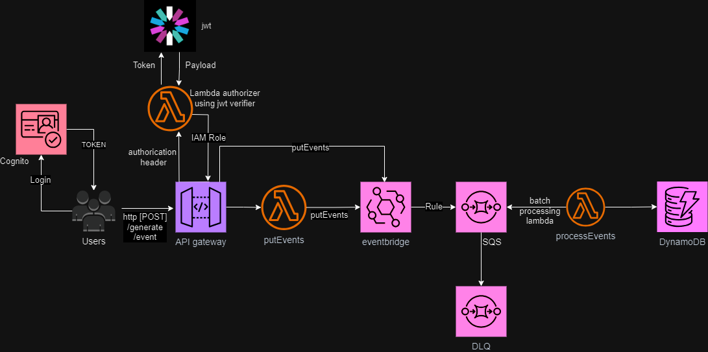

# Buld and Deploy a rest API with AWS serverless services using serverless framework

## What are the resources used in this architecture?

API Gateway

Lambda

Eventbridge

SQS

DynamoDB

IAM

The Diagram below shows the architecture. The Iam policy returned by the lambda authorizer is cached and issues rising from caching are taken care of. Also the http connection to AWS SDK is kept alive to reduce latency.

The diagram shows that if we do not need to the process the data, we should just send
the event object directly from the API gateway to eventbridge. But if we do need further processing of the data, we can use a lambda function to do that before passing on the message.

In the case where we needed to send the event from the API gateway object directly to eventbridge, we ensured that we passed the http method (i.e. POST, GET, etc.) into this event object by manually modifying the 'mapping template' chosing 
application/json as the content type.

# Steps used to Add httpMethod in API Gateway Mapping Template
1. Navigate to API Gateway Console:
-  Open the API Gateway Console.
-  Choose the API you want to modify.
2. Go to Integration Request:
-  Select the resource (e.g., POST /create) where the request is being sent to    
   EventBridge.
-  Go to Method Request → Integration Request.
-  Under the Body Mapping Templates, add a new mapping template if none exists (use 
   application/json as the content type).
3. Create the Mapping Template: In the body mapping template, you can extract the 
   httpMethod from the API Gateway context and include it in the JSON message.

   We added httpMethod to the Detail field thus:

   "Detail": "{ \"body\": $util.escapeJavaScript($input.body), \"httpMethod\": \"$context.httpMethod\" }",